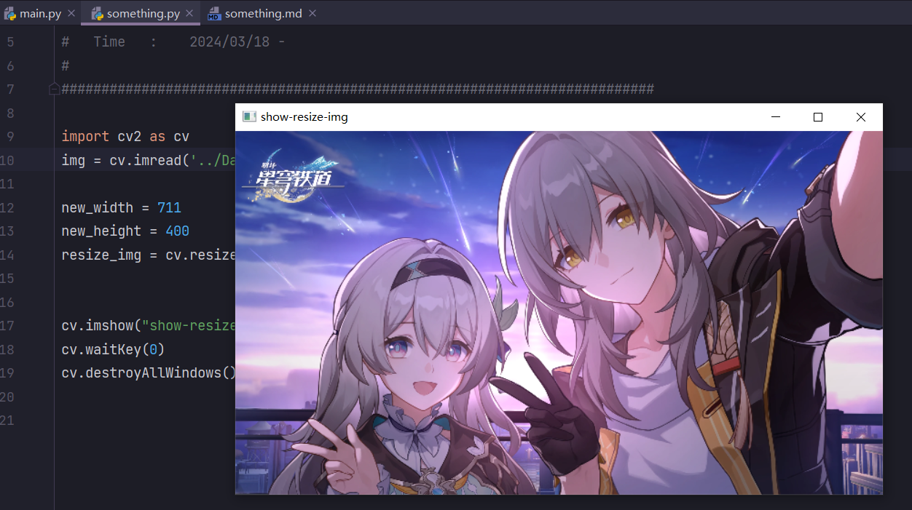
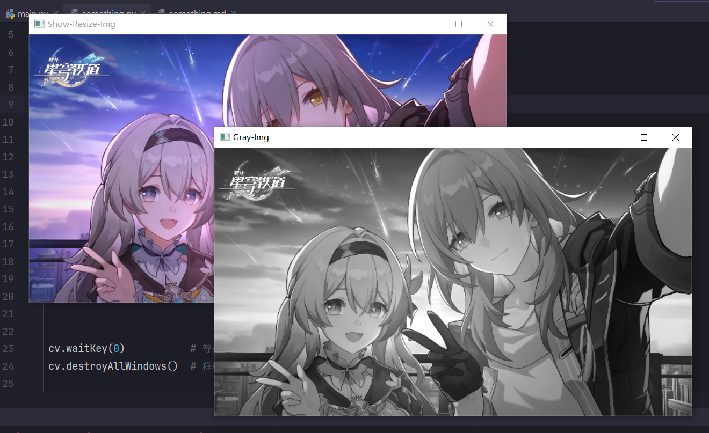
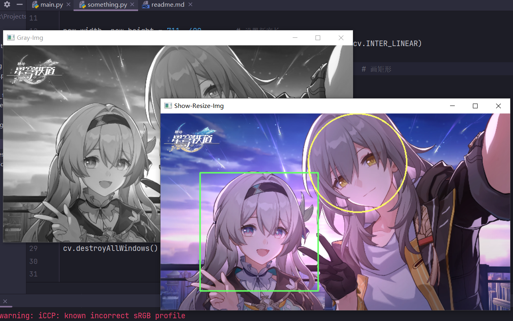
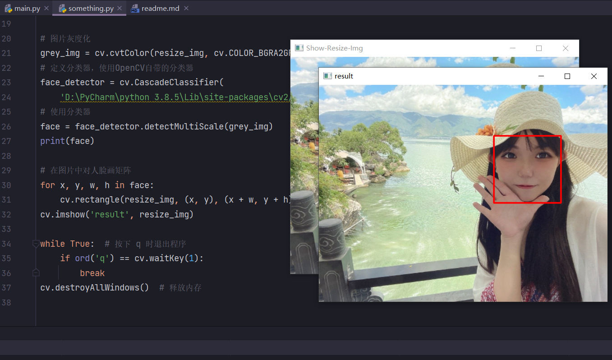

# ***一些简单的学习记录***

[学习参考博客-CSDN](http://t.csdnimg.cn/xLFnI)

---

### 1. 读取图片
- cv2.imshow()
  - 展示图像,参数为窗口名,argument 'mat'
  - 参数为图片地址

- cv2.waitKey()
  - 不断刷新图像，频率为delay，单位为ms
  - 返回值为当前键盘按键值
  - 没有按下按键则继续等待
  - 控制imshow()的持续时间

```python
import cv2 as cv            # 导入模块
img = cv.imread('test.png') # 读取图片
cv.imshow("show", img)      # 显示图片
cv.waitKey(0)               # 等待按键
cv.destroyAllWindows()      # 释放内存
```

```python
import cv2 as cv                        # 导入模块
img = cv.imread('../Data/firefly.png')  # 读取图片

new_width = 711
new_height = 400
resize_img = cv.resize(img, (new_width, new_height),
                       interpolation=cv.INTER_LINEAR)

cv.imshow("show-resize-img", resize_img)   # 显示图片
cv.waitKey(0)                       # 等待按键
cv.destroyAllWindows()              # 释放内存
```

#### 测试结果


### 2. 图片灰度化

- 图像灰度化目的：简化矩阵，提高运算速度。
- 彩色图像中的每个像素颜色由R、G、B三个分量来决定，而每个分量的取值范围都在0-255之间，这样对计算机来说，彩色图像的一个像素点就会有256\*256\*256=16777216种颜色的变化范围！而灰度图像是R、G、B分量相同的一种特殊彩色图像，对计算机来说，一个像素点的变化范围只有0-255这256种。彩色图片的信息含量过大，而进行图片识别时，其实只需要使用灰度图像里的信息就足够了，所以图像灰度化的目的就是为了提高运算速度。

---

- cv2.cvtColor()
  - 灰度转换函数
- cv2.imwrite()
  - 保存图片

```python
import cv2 as cv                        # 导入模块
img = cv.imread('../Data/firefly.png')  # 读取图片

new_width, new_height = 711, 400        # 设置新宽长
resize_img = cv.resize(img, (new_width, new_height), interpolation=cv.INTER_LINEAR)
cv.imshow("Show-Resize-Img", resize_img)        # 显示图片

gray_img = cv.cvtColor(img, cv.COLOR_BGR2GRAY)  # 灰度转换
cv.imwrite("../Data/gray_img.png", gray_img)    # 写入图片

resize_gray_img = cv.resize(gray_img, (new_width, new_height), interpolation=cv.INTER_LINEAR)
cv.imshow("Gray-Img", resize_gray_img)          # 显示图片


cv.waitKey(0)           # 等待按键
cv.destroyAllWindows()  # 释放内存
```
#### 测试结果


### 尺寸转换

- cv2.resize()
  - 调整图片大小，接收宽长元组

### 输出图片大小

- img.shape

### 按键退出

- ord('q')，返回q的ASCLL码

```python
import cv2 as cv                        # 导入模块
img = cv.imread('../Data/firefly.png')  # 读取图片

new_width, new_height = 711, 400        # 设置新宽长
resize_img = cv.resize(img, (new_width, new_height), interpolation=cv.INTER_LINEAR)
cv.imshow("Show-Resize-Img", resize_img)        # 显示图片

gray_img = cv.cvtColor(img, cv.COLOR_BGR2GRAY)  # 灰度转换
cv.imwrite("../Data/gray_img.png", gray_img)    # 写入图片

resize_gray_img = cv.resize(gray_img, (new_width, new_height), interpolation=cv.INTER_LINEAR)
cv.imshow("Gray-Img", resize_gray_img)          # 显示图片

while True:  # 按下 q 时退出程序
    if ord('q') == cv.waitKey(1):
        break
cv.destroyAllWindows()  # 释放内存
```

### 绘制矩形和圆形框

- cv2.rectangle(img, pt1, pt2, color, thickness=None, lineType=None, shift=None)
  - img 在图片上绘制
  - pt1 矩形的一个顶点
  - pt2 与pt1在对角线上相对的矩形的顶点
  - color 指定边框的颜色，由（B,G,R）组成
  - thinkness 为正值时代表线条粗细，为负值时边框实线

- cv2.circle(img, center, radius, color, thickness=None, lineType=None, shift=None)
  - img 输入的图片data
  - center 圆心位置
  - radius 圆的半径
  - color 圆的颜色
  - thickness 圆形轮廓的粗细（如果为正）。负厚度表示要绘制实心圆。

#### 测试结果


### 人脸检测

在路径 (Lib/site-packages/cv2/data) 下，可以找到需要xml文件，这些是OpenCV中自带的分类器，根据文件名我们可以看到有识别眼睛、身体、脸等等。

```
haarcascade_eye.xml
haarcascade_eye_tree_eyeglasses.xml
haarcascade_frontalface_alt.xml
haarcascade_frontalface_alt_tree.xml
haarcascade_frontalface_alt2.xml
haarcascade_frontalface_default.xml
haarcascade_fullbody.xml
haarcascade_lefteye_2splits.xml
haarcascade_lowerbody.xml
haarcascade_mcs_eyepair_big.xml
haarcascade_mcs_eyepair_small.xml
haarcascade_mcs_leftear.xml
haarcascade_mcs_lefteye.xml
haarcascade_mcs_mouth.xml
haarcascade_mcs_nose.xml
haarcascade_mcs_rightear.xml
haarcascade_mcs_righteye.xml
haarcascade_mcs_upperbody.xml
haarcascade_profileface.xml
haarcascade_righteye_2splits.xml
haarcascade_smile.xml
haarcascade_upperbody.xml
```

- 使用cv.CascadeClassifier(参数：分类器所在路径)方法定义一个分类器对象。

- detectMultiScale(self,
  - image: Any,
  - scaleFactor: Any = None,
  - minNeighbors: Any = None,
  - flags: Any = None,
  - minSize: Any = None,
  - maxSize: Any = None) 

  - 参数1：image–待检测图片，一般为灰度图像加快检测速度；
  - 参数2：objects–被检测物体的矩形框向量组；
  - 参数3：scaleFactor–表示在前后两次相继的扫描中，搜索窗口的比例系数。默认为1.1即每次搜索窗口依次扩大10%;
  - 参数4：minNeighbors–表示构成检测目标的相邻矩形的最小个数(默认为3个)。
  - 如果组成检测目标的小矩形的个数和小于 min_neighbors - 1 都会被排除。
  - 如果min_neighbors 为 0, 则函数不做任何操作就返回所有的被检候选矩形框，
  - 这种设定值一般用在用户自定义对检测结果的组合程序上；
  - 参数5：flags–要么使用默认值，要么使用CV_HAAR_DO_CANNY_PRUNING，如果设置为CV_HAAR_DO_CANNY_PRUNING，那么函数将会使用Canny边缘检测来排除边缘过多或过少的区域，
  - 因此这些区域通常不会是人脸所在区域
  - 参数6、7：minSize和maxSize用来限制得到的目标区域的范围。


```python
import cv2 as cv  # 导入模块

img = cv.imread('../Data/MandySa.jpg')  # 读取图片
# img = cv.imread('../Data/firefly.png')  # 读取图片

new_width, new_height = 512, 385        # 设置新宽长
# new_width, new_height = 711, 400        # 设置新宽长

resize_img = cv.resize(img, (new_width, new_height), interpolation=cv.INTER_LINEAR)
cv.imshow("Show-Resize-Img", resize_img)  # 显示图片

# 图片灰度化
grey_img = cv.cvtColor(resize_img, cv.COLOR_BGRA2GRAY)
# 定义分类器，使用OpenCV自带的分类器
face_detector = cv.CascadeClassifier(
    'D:\PyCharm\python 3.8.5\Lib\site-packages\cv2/data/haarcascade_frontalface_alt2.xml')
# 使用分类器
face = face_detector.detectMultiScale(grey_img)
print(face)

# 在图片中对人脸画矩阵
for x, y, w, h in face:
    cv.rectangle(resize_img, (x, y), (x + w, y + h), color=(0, 0, 255), thickness=2)
cv.imshow('result', resize_img)

while True:  # 按下 q 时退出程序
    if ord('q') == cv.waitKey(1):
        break
cv.destroyAllWindows()  # 释放内存
```

#### 测试结果


### 检测多个人脸

```python
import cv2 as cv
 
def face_detect_methed():
    # 图片灰度化
    grey_img = cv.cvtColor(img,cv.COLOR_BGRA2GRAY)
    # 定义分类器，使用OpenCV自带的分类器
    face_detector = cv.CascadeClassifier('G:/conda/envs/testOpencv/Lib/site-packages/cv2/data/haarcascade_frontalface_default.xml')
    # 使用分类器
    face = face_detector.detectMultiScale(grey_img,1.1,5,0,(10,10),(200,200))
    # 在图片中对人脸画矩阵
    for x,y,w,h in face:
        cv.rectangle(img,(x,y),(x+w,y+h),color=(0,0,255),thickness=2)
    cv.imshow('result',img)
 
#读取图像
img = cv.imread("faceMorePeople.png")
#调用检测函数
face_detect_methed()
 
while True:
    if ord('m') == cv.waitKey(0):
        break
 
cv.destroyAllWindows()
```

### 对视频的检测

- ***cap = cv2.VideoCapture(filepath)***
  - cv2.VideoCapture可以捕获摄像头，用数字来控制不同的设备，例如cv.VideoCapture(0)为电脑自带摄像头，1为外接摄像头。
  - 如果是视频文件，直接指定好路径即可,如 cv.VideoCapture('G:/1.mp4')，即读取在G盘中名为1的MP4视频文件。

- ***flag, frame = cap.read()***
  - 读取视频帧函数
  - 第一个参数flag为True或者False,代表有没有读取到图片
  - 第二个参数frame表示截取到一帧的图片

- ***使用一个循环判断是否捕获到图像***
  - 如果flag==false，说明视频结束，退出循环
  - 否则则继续将视频中捕获到的帧图像放入检测函数face_detect_method中进行检测。

```python
while True:
    flag,frame = cap.read()
    if not flag:
        break
    face_detect_method(frame)
    if ord('c')==cv.waitKey(1):
        break
```

- 释放图像 cap.release()
  - 使用结束后释放摄像头资源。

- WaitKey方法
  - 需要设置WaitKey方法的参数为1，如果为0的话则只能捕获到视频的第一帧，不能播放视频。

```python
import cv2 as cv  # 导入模块

# 读取摄像头
cap = cv.VideoCapture(0)

# 读取视频
# cap = cv.VideoCapture('G:/1.mp4')


# 检测方法定义
def face_detect_method(img):
    grey_img = cv.cvtColor(img, cv.COLOR_BGRA2GRAY)
    face_detector = cv.CascadeClassifier(
        "D:\PyCharm\python 3.8.5\Lib\site-packages\cv2/data/haarcascade_frontalface_default.xml")
    face = face_detector.detectMultiScale(grey_img, 1.05, 4)
    for x, y, w, h in face:
        cv.rectangle(img, (x, y), (x + w, y + h), (0, 255, 255), 1)
    cv.imshow("result", img)


# 循环判断
while True:
    flag, frame = cap.read()
    if not flag:
        break
    face_detect_method(frame)
    if ord('q') == cv.waitKey(1):
        break

cv.destroyAllWindows()
cap.release()
```

### 视频捕获

- cap = cv.VideoCapture('G:/1.mp4')

```python
import cv2 as cv
 
# 检测方法定义
def face_detect_method(img):
    grey_img = cv.cvtColor(img,cv.COLOR_BGRA2GRAY)
    face_detector = cv.CascadeClassifier(
        "D:\PyCharm\python 3.8.5\Lib\site-packages\cv2/data/haarcascade_frontalface_default.xml")
    face = face_detector.detectMultiScale(grey_img,1.02,4)
    for x,y,w,h in face:
        cv.rectangle(img,(x,y),(x+w,y+h),(255,0,0),2)
    cv.imshow("result",img)
 
#读取摄像头
#cap = cv.VideoCapture(0)
#读取视频
cap = cv.VideoCapture('G:/1.mp4')
 
# 循环判断
while True:
    flag,frame = cap.read()
    if not flag:
        break
    face_detect_method(frame)
    if ord('c')==cv.waitKey(1):
        break
 
cv.destroyAllWindows()
cap.release()
```

### 人脸信息录入

- cap.isOpened()
  - 判断视频是否读取成功，成功读取视频对象返回True

-  cv2.waitKey(1000) & 0xFF == ord('q') 是什么意思
  - cv2.waitKey(1000) 在1000ms内根据键盘输入返回一个值
  - 0xFF 一个十六进制数
  - ord('q') 返回q的ascii码

实际上在linux上使用waitkey有时会出现waitkey返回值超过了（0-255）的范围的现象。通过cv2.waitKey(1) & 0xFF运算，当waitkey返回值正常时 cv2.waitKey(1) = cv2.waitKey(1000) & 0xFF,当返回值不正常时，cv2.waitKey(1000) & 0xFF的范围仍不超过（0-255），就避免了一些奇奇怪怪的BUG。

- 代码实现
  - 使用电脑自带的摄像头进行人脸的信息捕获，使用num对保存图片进行计数
  - 使用cap.isOpened()方法来判断摄像头是否开启
  - 使用frame保存视频中捕获到的帧图像，k获取键盘按键，s代表保存图像，空格代表退出程序
  - 当按下s键时，使用cv2.imwrite方法对图片进行保存

```python
import cv2 as cv  # 导入模块

# 读取摄像头
cap = cv.VideoCapture(0)
# 记录保存图片的数目
num = 1

# 当摄像头开启时
while cap.isOpened():
    ret, frame = cap.read()
    cv.imshow("show", frame)
    # 获取按键
    k = cv.waitKey(1) & 0xFF
    # 按下s保存图像
    if k == ord('s'):
        cv.imwrite("F:/Projects/Python Pycharm/openCV_Test/Data/" + "People" + str(num) + ".face" + ".jpg", frame)
        print("successfully saved" + str(num) + ".jpg")
        print("------------------------------------------")
        # 计数加一
        num += 1
    # 按下空格退出
    elif k == ord(' '):
        break

cv.destroyAllWindows()
cap.release()
```

### 使用数据训练识别器

- 构建项目结构
  - data 和 trainer 文件夹
  - trainer为空文件夹
  - data文件夹下继续创建jm文件夹，在jm其中放置训练的图片，图片命名方式为：序号.姓名 

- 主要步骤
  - os.listdir可以获取path中的所有图像文件名
  - 然后使用os.path.join方法把文件夹路径和图片名进行拼接
  - 存储在imagePaths列表中，此时列表中存储的就是图片的完整路径，方便下一步open该图片。

- 运行问题
  - 识别不到cv2模块中的face属性
    - 使用pip install命令安装opencv-库 [参考博客](http://t.csdnimg.cn/nPVvC)

```python
import os
import cv2 as cv
from PIL import Image
import numpy as np


def getImageAndLabels(path):
    # 存储人脸数据
    faceSamples = []
    # 存储姓名数据
    ids = []
    # 储存图片信息
    imagePaths = [os.path.join(path, f) for f in os.listdir(path)]
    # 人脸检测分类器
    face_detector = cv.CascadeClassifier(
        "D:\PyCharm\python 3.8.5\Lib\site-packages\cv2/data/haarcascade_frontalface_default.xml")
    # 遍历列表中的图片
    for imagePath in imagePaths:
        # 打开图片，灰度化
        PIL_img = Image.open(imagePath).convert('L')
        # 把图像转换为数组，
        img_numpy = np.array(PIL_img, 'uint8')
        # 获取图片人脸特征
        faces = face_detector.detectMultiScale(img_numpy)
        # 获取每张图片的id和姓名
        id = int(os.path.split(imagePath)[1].split('.')[0])
        # 预防无面容照片
        for x, y, w, h in faces:
            ids.append(id)
            faceSamples.append(img_numpy[y:y + h, x:x + w])

            # 打印脸部特征和id
        print('id:', id)
        print('fs:', faceSamples)
        return faceSamples, ids


if __name__ == '__main__':
    # 图片路径
    path = '../Train_Test/data/jm/'
    # 获取图像数组和id标签数组
    faces, ids = getImageAndLabels(path)

    # 加载识别器
    recognizer = cv.face.LBPHFaceRecognizer_create()
    # 训练
    recognizer.train(faces, np.array(ids))
    # 保存文件
    recognizer.write('../Train_Test/trainer/trainer.yml')
```

### OpenCV 画线

- cv2.line(image,starting cordinates,ending cordinates,color,thickness)
  - ❤ image：需绘制直线的图像
  - ❤ starting cordinates ：直线的起点
  - ❤ ending cordinates ：直线的终点
  - ❤ color ：线的颜色
  - ❤ thickness ：线的粗细像素

### 多线程测试

- Python提供了thread、threading等模块来进行线程的创建与管理，后者在线程管理能力上更进一步

**创建线程**
```python
from threading import Thread, current_thread

def target01(args1, args2):
	print("这里是{}".format(current_thread().name))

# 创建线程
thread01 = Thread(target=target01, args="参数", name="线程1")
# 设置守护线程【可选】
thread01.setDaemon(True)
# 启动线程
thread01.start()
```

**设置守护线程**
```python
from threading import Thread, current_thread

def target01():
	print("这里是{}".format(current_thread().name))

# 创建线程 设置守护线程
thread01 = Thread(target=target01, daemon=True)
# thread01.setDaemon(True)
# 启动线程
thread01.start()
```

**设置线程阻塞**
```python
import time
from threading import Thread, current_thread


def target():
    if current_thread().name == "1":
        time.sleep(5)
    else:
        time.sleep(6)
    print("线程{}已退出".format(current_thread().name))


thread01 = Thread(target=target, daemon=True, name="1")
thread02 = Thread(target=target, daemon=True, name="2")

thread01.start()
thread02.start()

print("程序因线程1陷入阻塞")
thread01.join(timeout=3)
print("程序因线程2陷入阻塞")
thread02.join(timeout=3)
print("主线程已退出")
```

### 线程之间通信方法

- 线程之间共享一块内存，子线程可以通过指定target来执行一个函数，但是这个函数的返回值是没有办法直接传回主线程的。
- 使用多线程用于执行一些其他任务，获取子线程的结果十分重要。
- 使用全局变量虽然可行，但是资源的并发读写会带来线程安全问题。

**线程锁**

- 多个线程对同一份资源进行读写操作时，可以使用线程锁来确保数据安全。
- python的多种锁：同步锁Lock、递归锁RLock、条件锁Condition、事件锁Event、信号量锁Semaphore
-  可以通过threading.lock类来创建锁对象，一旦一个线程获得一个锁，会阻塞之后所有尝试获得该锁对象的线程，直到它被重新释放。

```python
from threading import Thread, Lock
from time import sleep

book_num = 100  # 图书馆最开始有100本图书
bookLock = Lock()  # 锁


def books_return():  # 还书
    global book_num
    while book_num < 105:
        bookLock.acquire()  # 等待资源使用
        book_num += 1
        print("[R] - 归还1本，现有图书{}本".format(book_num))
        bookLock.release()  # 归还资源
        sleep(1)  # 模拟事件发生周期


def books_lease():  # 借书
    global book_num
    while book_num < 105:
        bookLock.acquire()  # 等待资源使用
        book_num -= 1
        print("[L] - 借走1本，现有图书{}本".format(book_num))
        bookLock.release()  # 归还资源
        sleep(2)  # 模拟事件发生周期


if __name__ == "__main__":
    thread_lease = Thread(target=books_lease)
    thread_return = Thread(target=books_return)
    thread_lease.start()
    thread_return.start()
```

### **queue模块(同步队列类)**

- 可以采用Python的queue模块来实现线程通信。Python中的 queue 模块实现了多生产者、多消费者队列，特别适用于在多线程间安全的进行信息交换。
- 该模块提供了4种我们可以利用的队列容器，分别Queue（先进先出队列）、LifoQueue（先进后出队列）、PriorityQueue（优先级队列）、SimpleQueue（无界的先进先出队列，简单实现，缺少Queue中的任务跟踪等高级功能

```python
Queue(maxsize=5)  # 创建一个FIFO队列，并制定队列大小，若maxsize被指定为小于等于0，则队列无限大

Queue.qsize() # 返回队列的大致大小，注意并不是确切值，所以不能被用来当做后续线程是否会被阻塞的依据

Queue.empty() # 判断队列为空是否成立，同样不能作为阻塞依据

Queue.full()  # 判断队列为满是否成立，同样不能作为阻塞依据

Queue.put(item, block=True, timeout=None) # 投放元素进入队列，block为True表示如果队列满了投放失败，将阻塞该线程，timeout可用来设置线程阻塞的时间长短（秒）；
# 注意，如果block为False，如果队列为满，则将直接引发Full异常，timeout将被忽略（在外界用try处理异常即可）
Queue.put_nowait(item) # 相当于put(item, block=False)

Queue.get(block=True, timeout=False) # 从队列中取出元素，block为False而队列为空时，会引发Empty异常
Queue.get_nowait() # 相当于get(block=False)

Queue.task_done() # 每个线程使用get方法从队列中获取一个元素，该线程通过调用task_done()表示该元素已处理完成。

Queue.join() # 阻塞至队列中所有元素都被处理完成，即队列中所有元素都已被接收，且接收线程全已调用task_done()。

```

**示例**
```python
import queue
from random import choice  # Choose a random element from a non-empty sequence.
from threading import Thread

q = queue.Queue(maxsize=5)
dealList = ["红烧猪蹄", "卤鸡爪", "酸菜鱼", "糖醋里脊", "九转大肠", "阳春面", "烤鸭", "烧鸡", "剁椒鱼头", "酸汤肥牛", "炖羊肉"]


def cooking(chef_name: str):
    for i in range(4):
        deal = choice(dealList)
        q.put(deal, block=True)
        print("厨师{}给大家带来一道：{}  ".format(chef_name, deal))


def eating(cust_name: str):
    for i in range(3):
        deal = q.get(block=True)
        print("顾客{}吃掉了：{}  ".format(cust_name, deal))
        q.task_done()


if __name__ == "__main__":
    # 创建并启动厨师ABC线程，创建并启动顾客1234线程
    thread_list_chef = [Thread(target=cooking, args=chef_name).start() for chef_name in ["A", "B", "C"]]
    thread_list_cust = [Thread(target=eating, args=str(cust_name)).start() for cust_name in range(4)]
    # 队列阻塞，直到所有线程对每个元素都调用了task_done
    q.join()
```

### 杀死线程

- 在一些场景下，我们可能需要杀死某个线程，但是在这之前，请仔细的考量代码的上下文环境。
- 强制杀死线程可能会带来一些意想不到的结果，并且从程序设计来讲，这本身就是不合理的。
- 而且，锁资源并不会因为当前线程的退出而释放，这在程序运行过程中，可能会成为典型的死锁场景。所以杀死线程之前，请一定慎重。


可以用全局变量给出一个flag，线程任务采用循环形式进行，每次循环都会检查该flag，外界可以通过修改这一flag来通知这一线程退出循环，结束任务，从而起到杀死线程的目的，但请注意，为了线程安全，退出前一定要释放这一线程所占用的资源。
```python
import time
from threading import Lock, Thread
from time import sleep

flag = True
lock = Lock()
book_num = 100


def tar():
    global flag, lock, book_num
    while True:
        lock.acquire()
        # 线程任务逻辑
        if flag is False:
            break
        print("book={}, and add 1.".format(book_num))
        book_num += 1
        time.sleep(0.5)
        lock.release()
    lock.release()


if __name__ == "__main__":
    thread = Thread(target=tar)
    thread.start()
    print("\n3秒后线程会被杀死")
    sleep(3)
    flag = False
    print("线程已被杀死")
```


